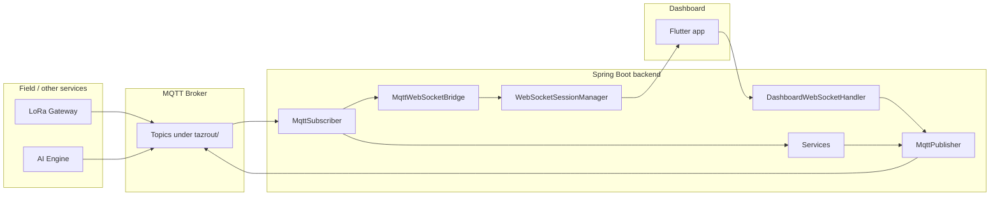

# Tazrout Dashboard — Backend Documentation

This document describes the **TAZROUT-Dashboard** Spring Boot backend: what it does, how the main pieces fit together, and how to configure and run it. It reflects the current implementation under `TAZROUT-Dashboard/backend`.

---

## 1. Purpose

The backend sits between:

- **Mosquitto (MQTT)** — field gateway, AI engine, and other services publish and subscribe on the `tazrout/…` topic tree.
- **The Flutter dashboard** — connects over **WebSocket** for live updates and can send a small set of commands back through the backend to MQTT.

The server **subscribes** to broker traffic, **routes** messages to services (persistence, preferences, notifications, and so on), **relays** traffic to connected WebSocket clients, and **publishes** aggregated or outbound MQTT messages where needed.

---

## 2. Technology Stack

| Area | Choice |
|------|--------|
| Runtime | Java 17 |
| Framework | Spring Boot 3.2.x |
| Messaging | Eclipse Paho MQTT async client (`MqttAsyncClient`) |
| Real-time to clients | Spring WebSocket (`TextWebSocketHandler`) |
| Persistence (intended) | Spring Data JPA, PostgreSQL driver |
| JSON | Jackson (`ObjectMapper`) |
| Build | Maven (`mvn clean install`, `mvn spring-boot:run`) |

Dependencies are declared in `pom.xml` (Web, JPA, WebSocket, `spring-integration-mqtt`, PostgreSQL, Jackson, Lombok optional, DevTools optional, Test).

---

## 3. Getting Started

### Prerequisites

- JDK 17  
- Maven 3.x  
- A reachable **MQTT broker** (defaults assume `tcp://localhost:1883` if not overridden).  
- **PostgreSQL** if you enable full JPA datasource usage (see §7).

### Run

From the `backend` directory:

```bash
mvn spring-boot:run
```

Default HTTP port: **8080** (`server.port` in `src/main/resources/application.properties`).

### Tests

```bash
mvn test
```

---

## 4. Configuration

All tunables live in **`src/main/resources/application.properties`**.

### Server

- `server.port` — HTTP port (default `8080`).

### Database

- `spring.datasource.url`, `spring.datasource.username`, `spring.datasource.password`, `spring.datasource.driver-class-name`  
- JPA: `spring.jpa.hibernate.ddl-auto`, dialect, `show-sql`, etc.

Use environment-specific values and avoid committing real credentials to source control.

### MQTT

| Property | Role |
|----------|------|
| `mqtt.broker.url` | Broker URI (code default: `tcp://localhost:1883`) |
| `mqtt.client.id` | Base client id (each component appends a unique suffix) |
| `mqtt.username` / `mqtt.password` | Optional broker auth |
| `mqtt.connection.timeout` | Connection timeout (seconds) |
| `mqtt.keep.alive.interval` | Keep-alive (seconds) |

`MqttConfig` builds a shared **`MqttConnectOptions`** bean: automatic reconnect, non-clean session, optional credentials.

### WebSocket

| Property | Role |
|----------|------|
| `websocket.endpoint` | Registered path (default `/api/v1/ws/realtime`) |
| `websocket.allowed.origins` | Allowed origin patterns (default `*`) |

---

## 5. High-Level Architecture



1. **MqttSubscriber** connects with a **unique client id**, subscribes to `tazrout/#`, and on each message forwards to the WebSocket path and dispatches to services by topic.  
2. **MqttWebSocketBridge** wraps each MQTT message in a small JSON frame and **broadcasts** to all open WebSocket sessions.  
3. **DashboardWebSocketHandler** accepts **JSON commands** from the client and, for allowed topics only, publishes via **MqttPublisher**.

---

## 6. MQTT Layer

### 6.1 Topic registry — `MqttTopics`

Central constants and helpers (e.g. `isZoneSensorTopic`) live in `dz.tazrout.dashboard.mqtt.MqttTopics`. Wildcard subscription: **`tazrout/#`**.

### 6.2 Subscriber — `MqttSubscriber`

- Uses **`MqttAsyncClient`** with `clientId + "-subscriber-" + UUID` (avoids duplicate client id collisions).  
- Subscribes at QoS **1** to `MqttTopics.ROOT_WILDCARD`.  
- **Every** incoming message is passed to `MqttWebSocketBridge.forward(topic, payload)` for the dashboard.  
- Parsed JSON is routed to:

  | Condition | Handler |
  |-----------|---------|
  | Zone sensor topics | `SensorService.handleSensorReading` |
  | Zone state or valve ACK | `ZoneService.handleZoneEvent` |
  | `tazrout/ai/decisions` or `…/latest` | `AiDecisionService.handleDecision` |
  | AI alerts / emergency alert topic | `NotificationService.handleEmergencyAlert` |
  | Gateway heartbeat / status | `NotificationService.handleGatewaySignal` |
  | `tazrout/settings/preferences` | `PreferencesService.handlePreferencesUpdate` |
  | System control / emergency stop | `NotificationService.handleSystemControl` |

- Non-JSON payloads are wrapped as a JSON object with a `raw_payload` field for downstream handling.  
- **`@PreDestroy`** disconnects and closes the client cleanly.

### 6.3 Publisher — `MqttPublisher`

- Separate **`MqttAsyncClient`**: `clientId + "-publisher-" + UUID`.  
- **`publish(topic, payload)`** — QoS 1, not retained.  
- **`publish(topic, payload, qos, retained)`** — full control.  
- Failures are logged; **`@PreDestroy`** disconnects and closes the client.

Intended publish targets (see file header in `MqttPublisher.java`) include dashboard summary, performance, notifications, analytics prefixes, backend/emergency status, preferences confirmation, and support contact topics — actual calls depend on the service layer.

### 6.4 WebSocket bridge — `MqttWebSocketBridge`

Builds a JSON object per message:

- `topic` — MQTT topic string  
- `timestamp` — ISO-8601 instant  
- `payload` — original MQTT payload string  

Then calls `WebSocketSessionManager.broadcast(...)`.

---

## 7. WebSocket Layer

### Endpoint

Registered in `WebSocketConfig`: default **`/api/v1/ws/realtime`** (overridable via `websocket.endpoint`).

### Server → client (live data)

Clients receive **text frames** whose body is JSON produced by the MQTT bridge (see §6.4).

### Client → server (commands)

`DashboardWebSocketHandler` expects JSON with:

- **`topic`** (string) — MQTT topic to publish  
- **`payload`** (string or JSON) — body to send  
- Optional: **`qos`** (default `1`), **`retained`** (default `false`)

**Security note:** only these topics are accepted from WebSocket clients:

- `tazrout/system/control`  
- `tazrout/system/emergency/stop`  
- `tazrout/settings/preferences`  

Anything else is rejected and logged.

### Session management — `WebSocketSessionManager`

Thread-safe set of sessions; `broadcast` skips closed sessions and synchronizes per-session sends.

---

## 8. Service and Domain Layer (overview)

| Package / area | Responsibility |
|----------------|----------------|
| `service.*` | Business logic: sensors, zones, AI decisions, preferences, notifications, analytics, etc. |
| `repository.*` | Spring Data JPA repositories |
| `model.*` | JPA entities |
| `dto.*` | Data transfer objects for API or aggregation shapes |

Concrete behavior (validation rules, MQTT republish triggers) is defined in each service class; MQTT entry points are wired from `MqttSubscriber` as in §6.2.

---

## 9. Application Entry and Database Notes

- **`TazroutApplication`** is the Spring Boot entry point.  
- It currently **excludes** `DataSourceAutoConfiguration`. That means automatic DataSource/JPA bootstrap from `application.properties` alone may be disabled unless you add explicit configuration or remove the exclusion.  
- **`DatabaseConfig.java`** in the tree is presently **comment-only** (no `@Configuration` beans). If you need full JPA against PostgreSQL, align `TazroutApplication` with your `DatabaseConfig` or rely on default auto-configuration and remove the exclusion once beans are defined.

---

## 10. Operational Checklist

1. Start **PostgreSQL** and create the `tazrout` database if you use JPA with a live schema.  
2. Start **Mosquitto** (or your broker) and set `mqtt.broker.url` (and credentials if required).  
3. Start the backend; confirm logs show MQTT connect and subscription to `tazrout/#`.  
4. Connect the dashboard WebSocket to `ws://<host>:8080/api/v1/ws/realtime` (or your configured endpoint).  
5. Verify live frames when publishers send to `tazrout/…` topics.

---

## 11. File Guide (main components)

| File | Role |
|------|------|
| `TazroutApplication.java` | Bootstraps the application |
| `config/MqttConfig.java` | `MqttConnectOptions` bean |
| `config/WebSocketConfig.java` | Registers WebSocket handler and path |
| `config/DatabaseConfig.java` | Reserved for DB/JPA setup (implement as needed) |
| `mqtt/MqttTopics.java` | Topic constants and matchers |
| `mqtt/MqttSubscriber.java` | Inbound MQTT + routing + bridge to WS |
| `mqtt/MqttPublisher.java` | Outbound MQTT |
| `mqtt/MqttWebSocketBridge.java` | MQTT → WebSocket JSON frames |
| `websocket/DashboardWebSocketHandler.java` | WebSocket lifecycle + whitelisted MQTT publish |
| `websocket/WebSocketSessionManager.java` | Session set and broadcast |
| `application.properties` | Ports, DB, MQTT, WebSocket placeholders |
| `pom.xml` | Dependencies and build |

---

*This file is the canonical high-level backend overview for the TAZROUT-Dashboard backend module. For line-level topic lists, also refer to the file headers in `MqttPublisher.java`, `MqttSubscriber.java`, and `MqttTopics.java`.*
